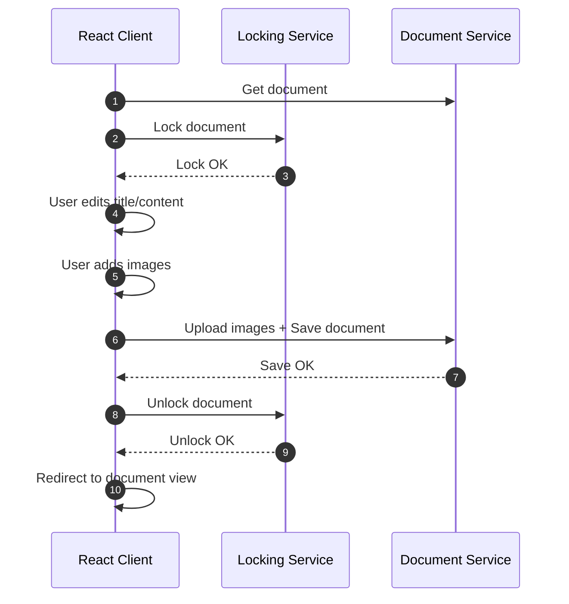

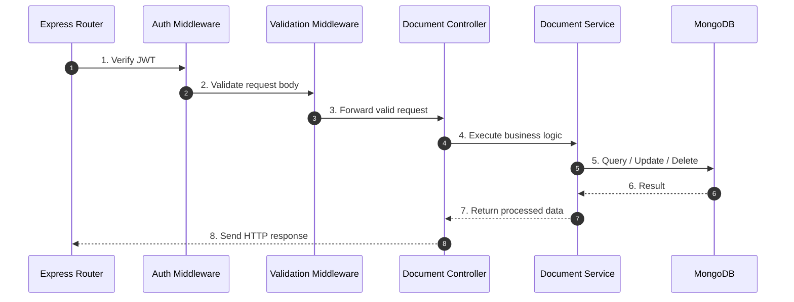

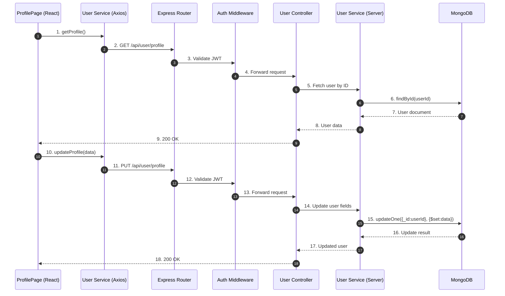

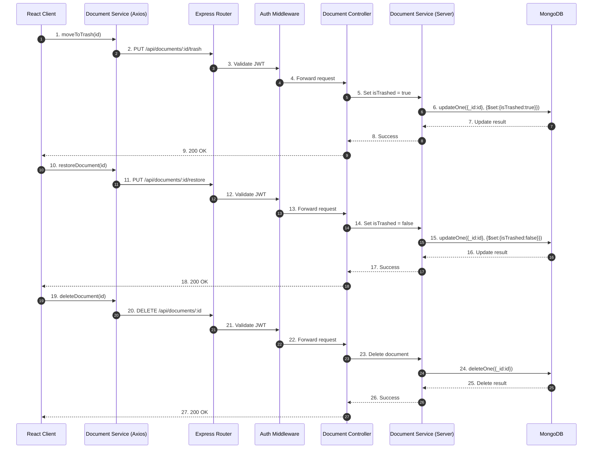

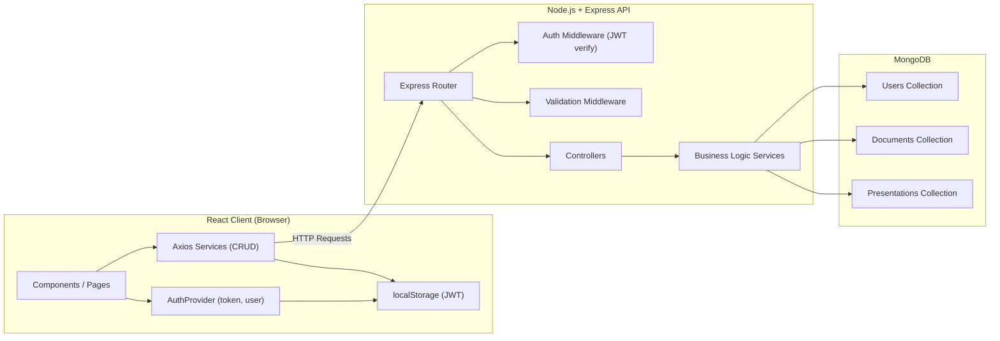

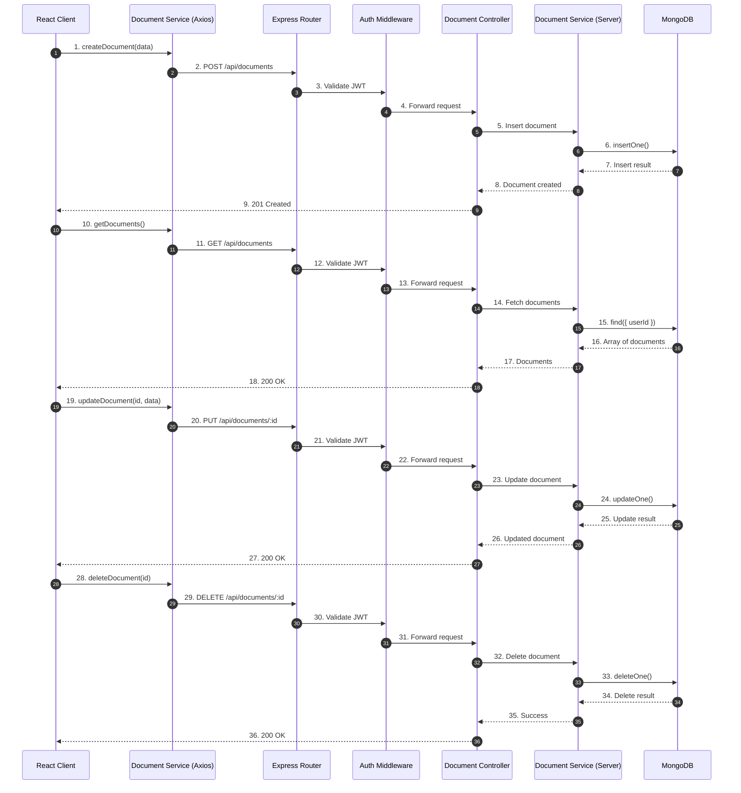

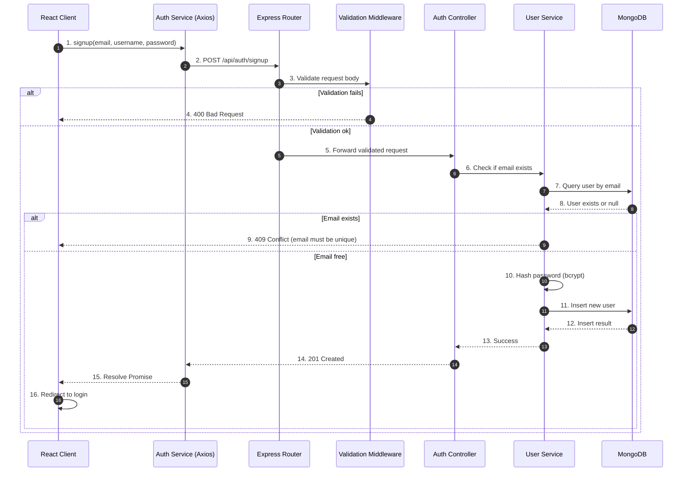

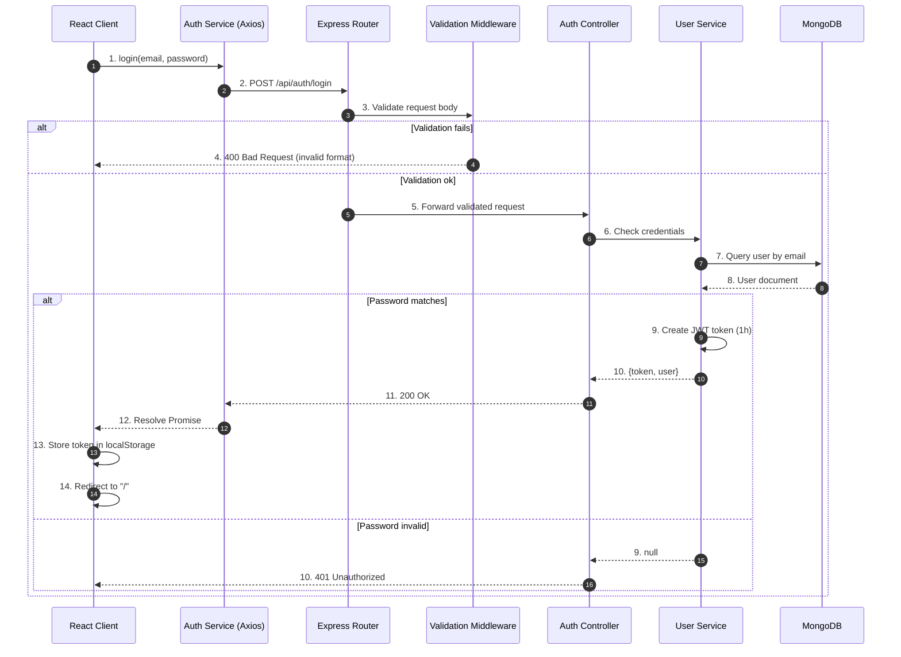

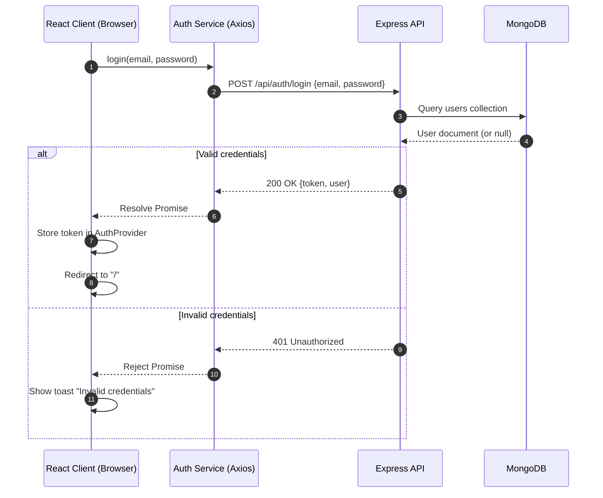
## improved localstorage added

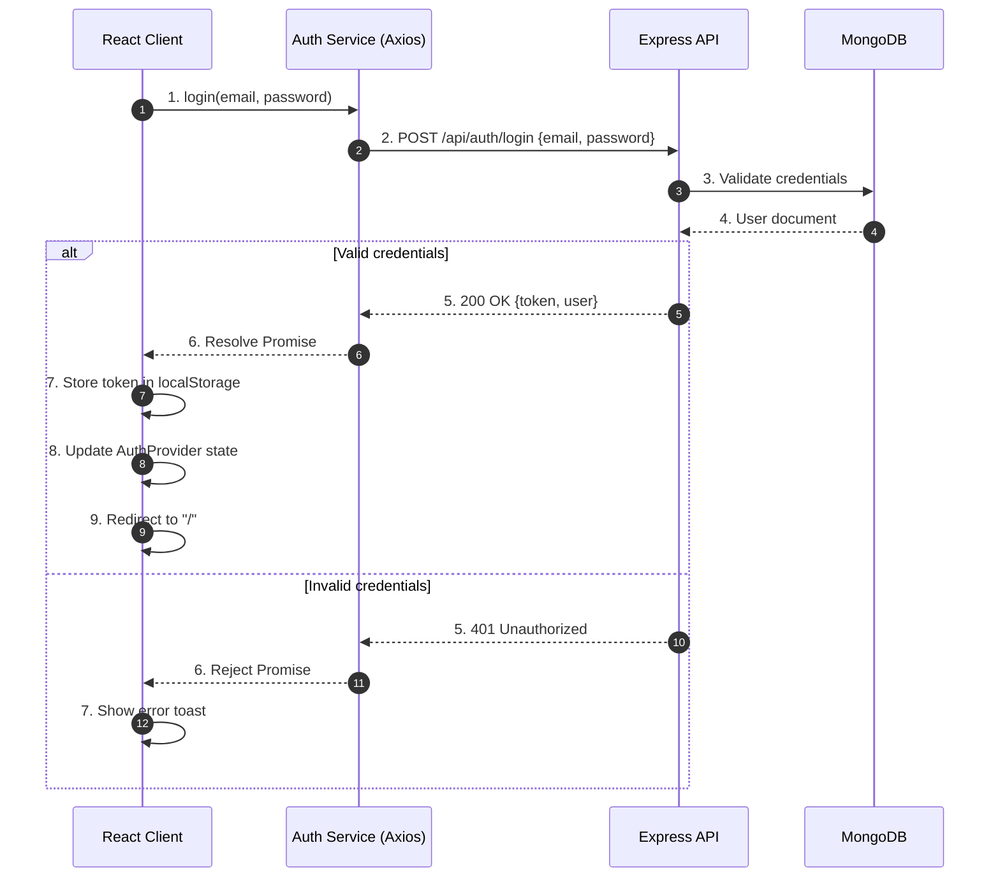

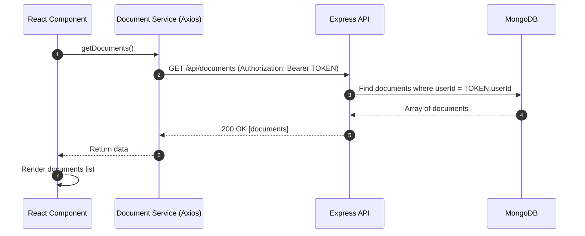

STRUCTURE
tähän sijainnit hakemistossa ja riipppuvuus suhteet mermaid?
COPILOT "The Client‑Side UI Stack"

presentation can be swipe right left like a carousel implement

https://laakktidev.github.io/LUT_AWA_Project_Work/server/docs/
https://laakktidev.github.io/LUT_AWA_Project_Work/client/docs/

learn to express me an work in english pretty much  better
Because not natural born english speakinn person.English grammatic and formation from rally englisht to sophistics english
Test, example and demo data generation.
I have spent great moment but less great as well with copilot. The problems and misunderstandig mislea dcause dmostyly I think free tier.
Like Pekkis has said need practise also with AI as least free tier version need exprience and at least basic understanding the topic in focus.
think I have learned from ai and ai, so this kind of project implement time could be much shorter
Mainitse myös usein menee paljon aikaa UI-suunnitteluun ja toteutukseen, joten AI:n hyödyntäminen UI-koodin nopeuttamisessa on ollut merkittävä ajansäästötekijä. AI on auttanut luomaan nopeasti käyttöliittymän perusrakenteen ja tyylit, mikä on vapauttanut aikaa keskittyä enemmän sovelluksenlogiikkaan ja ominaisuuksiin.
Normally UI design takes a lot of time, so 
copilot is pretty good on that, previosly used Bootstrap now MUI first time, copilot teached me with this UI library new for me.
MYös auttanut Typesciptin kannsa
# Declaration of AI Usage

## 1. AI Systems Used

The following AI systems were used during the development of this assignment:

- **GitHub Copilot** (VS Code integration)
- **ChatGPT (OpenAI)**
- **Google Translate**

---

## 2. How and Where AI Was Used

AI tools were used as supportive development assistants during different phases of the project. Their role was that of a *technical assistant*, not an autonomous developer.

### a) Code Assistance and Refactoring

GitHub Copilot was used to:

- Generate boilerplate code and routine implementations  
- Suggest refactoring improvements  
- Provide alternative implementations and modern ES6+ syntax  
- Assist in converting older coding patterns into modern ECMAScript standards  
- Generate basic unit tests (which were then reviewed and validated manually)  
- Suggest naming conventions for variables, functions, and components  
- Help structure code when the application grew larger and more complex  

All generated code was manually reviewed, tested, and modified when necessary.  
Code that was not fully understood was not accepted into the final implementation.

---

### b) UI Development (Material UI – MUI)

Material UI (MUI) was new to the author. AI assistance was used to:

- Learn component usage and patterns  
- Speed up UI layout creation  
- Reduce time spent on styling and repetitive UI tasks  
- Resolve UI-related error messages  

AI significantly reduced time consumption in UI implementation, which is typically one of the most time-intensive parts of development.

---

### c) Architecture and Best Practices

AI was consulted for:

- Architectural suggestions  
- Context-based state management (e.g., global token/user handling)  
- Best practice discussions  
- Error handling strategies  
- TypeScript strict mode issues  
- Interpretation of error messages  

All architectural decisions were ultimately made by the author, based on prior MERN-stack experience and earlier studies (e.g., FullStackOpen and other courses).

---

### d) Documentation and Language Support

AI tools (ChatGPT and Google Translate) were used to:

- Improve English language quality  
- Proofread and refine text  
- Format documentation professionally  
- Assist in writing JSDoc/TSDoc comments  
- Improve clarity and structure of explanations  

The core content and technical understanding were produced by the author, while AI helped improve linguistic quality.

---

### e) Learning and Knowledge Refresh

AI was used to:

- Refresh previous MERN-stack knowledge  
- Explore updated JavaScript/TypeScript features  
- Discuss alternative approaches  
- Compare implementation options  

The author has previous experience in MERN-stack development.  
AI acted as an interactive sparring partner to explore ideas, not as a replacement for foundational knowledge.

---

## 3. Critical Reflection on AI Usage

AI proved to be:

- A productive assistant for repetitive tasks  
- Helpful in accelerating UI work  
- Useful for refactoring and syntax modernization  
- Valuable for documentation and English writing  

However, AI occasionally:

- Produced hallucinated or incorrect code  
- Suggested non-optimal practices  
- Generated solutions requiring careful validation  

Therefore, continuous critical evaluation was necessary. Effective use of AI required:

- Prior technical knowledge  
- Ability to interpret suggestions  
- Testing and validation of all generated outputs  
- Careful step-by-step prompting  

AI was treated as “a good servant but a bad master” — a tool that enhances productivity when supervised, but unreliable if used without understanding.

---

## 4. Statement of Responsibility

All final decisions, architecture choices, and code integrations were made by the author.  
No code was accepted without understanding its functionality.  
All features were manually tested and verified.

AI assistance supported productivity and learning, but responsibility for correctness, design, and implementation remains entirely with the author.

| Done | Points | Feature |
|------|---------|---------|
| [x] | [25] | Basic features with documentation |
| [x] | [3] | Frontside framework (React/Angular/Vue) |
| [x] | [2] | WYSIWYG editor |
| [x] | [3] | PDF download |
| [x] | [1] | Creation + updated timestamps |
| [x] | [1] | Sorting documents |
| [x] | [2] | Profile picture upload |
| [ ] | [ ] | Commenting parts of document |
| [ ] | [ ] | Spreadsheets (SUM + cells) |
| [x] | [3] | Presentation slides |
| [ ] | [ ] | Folder hierarchy |
| [x] | [1] | Dark/bright modes |
| [x] | [2] | Recycle bin |
| [x] | [1] | Clone document |
| [x] | [2] | Upload images |
| [x] | [2] | UI translation |
| [ ] | [ ] | Multi‑user editing |
| [x] | [4] | Unit + automated tests |
| [x] | [2] | Search functionality |
| [x] | [2] | Pagination |
| [x] | [1] | Send public document link via email |  
| [x] | [1] | Handling token expiration in every route |  

58 points total

**TESTS** 
#### Server
npm install --save-dev jest ts-jest @types/jest supertest @types/supertest
npx ts-jest config:init
->
jest.config.js
module.exports = {
  preset: "ts-jest",
  testEnvironment: "node",
  testMatch: ["**/tests/**/*.test.ts"],
  verbose: true,
};

#### Client
npm install --save-dev cypress
