### Sign-up and Login 

The animation below demonstrates the full sign‑up and login workflow for a new user.

1. On the login page, select **Sign‑up** to create a new account.
    
2. Enter the required information in the sign‑up form.
    
3. In the example, an incorrect password is entered first to demonstrate validation.
    
    - An error toast appears to inform the user about the issue.
        
4. After correcting the password, the account is successfully created.
    
    - A success toast confirms the registration.
        
5. After registration, the application returns to the login page.
    
    - Enter the newly created credentials to log in.
        
6. Once logged in, the **Documents** list is empty because this is a brand‑new account.
    

This animation illustrates both the validation feedback and the normal workflow for first‑time users.

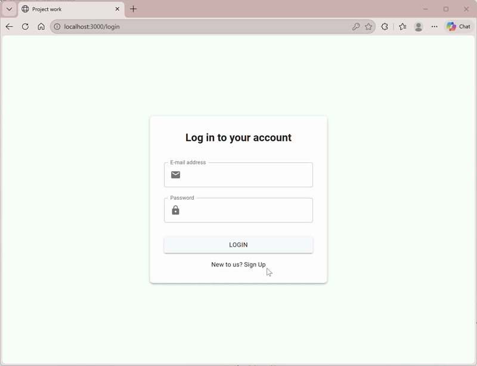

### Logout

You can log out of the application at any time using the menu in the header.

1. Open the **menu** located in the top‑right corner of the header.
    
2. Select **Logout** from the menu options.
    
3. After logging out, you are returned to the login page.
    
4. Your session is closed, and you will need to enter your credentials again to access your documents.
    

Logging out is recommended when using a shared or public device.

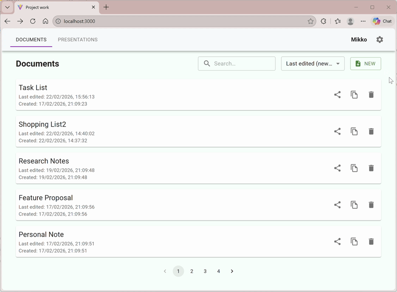

### Create Document

The animation below demonstrates how to create a new document.

1. Open the **Documents** page.
    
2. Click the **New** button in the header to start creating a document.
    
3. Enter a **title** and write your **content** in the editor.
    
4. You can also add images by selecting files from your device.
    
5. When you are ready, click **Save** to store the new document.
    
6. After saving, the document appears in your personal documents list.
    

This workflow shows how to create and save a new document from scratch.

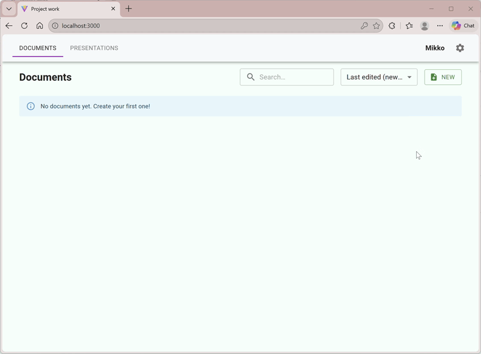

### Read and Update Document

You can open and edit any of your existing documents directly from the Documents page.

1. On the **Documents** page, select a document from the list.
2. The document opens in full view, showing the complete content.
3. To make changes, click the **Edit** button.
4. The editor view appears, allowing you to update the **title**, **content**, and any **images**.
5. After making your changes, click **Save** to update the document.
6. Once saved, the updated document is shown again in the list and can be reopened at any time.

This workflow demonstrates how to view an existing document and update it when needed.

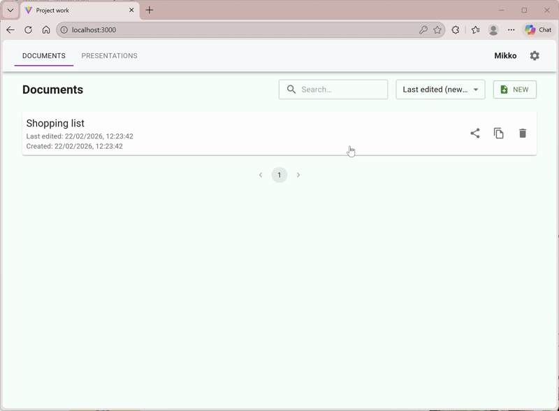

### Delete and Restore Document

Documents can be deleted, restored, or permanently removed using the Trash feature.

#### Delete a Document
1. Open the **Documents** page.
2. Select a document from the list.
3. Click the **Delete** button.
4. The document is moved to **Trash** instead of being permanently removed.

Deleted documents remain in Trash until you decide to restore or permanently delete them.
#### Restore a Document
1. Open the **Trash** view from the header menu.
2. Select a document you want to recover.
3. Click **Restore**.
4. The document returns to your main Documents list.
#### Permanently Delete a Document
You can remove documents permanently in two ways:
#### Delete a single document
1. Open the **Trash** view.
2. Select a document.
3. Click **Delete Permanently**.
#### Empty the entire Trash
1. Open the **Trash** view.
2. Select **Empty Trash**.
3. All documents currently in Trash are permanently removed.

Once a document is permanently deleted, it cannot be recovered.

This workflow demonstrates how to safely delete documents, restore them when needed, and manage the Trash to keep your workspace organized.

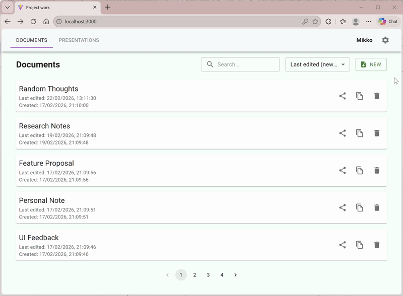

### Insert Image into Document

The animation below demonstrates how to add an image to your document.

1. Open a document in **Edit** mode.
2. Click the **Add Image** button in the editor toolbar.
3. Select an image file from your device.
4. The selected image is uploaded and inserted directly into the document.
5. Click **Save** to store the updated document with the inserted image.

This workflow shows how images can be added seamlessly to enhance your document content.

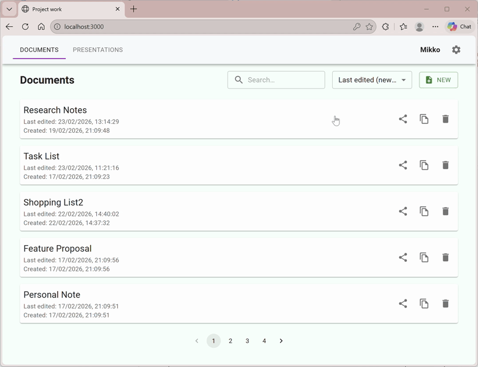

### Pagination

When you have many documents, the list is automatically divided into pages to keep the view clear and easy to navigate.

1. Open the **Documents** page.
2. At the bottom of the list, use the **pagination controls** to move between pages.
3. Click **Next** or **Previous** to browse through your documents.
4. You can also jump directly to a specific page by selecting its page number.
5. The number of documents shown per page is fixed to ensure consistent performance.

Pagination helps you navigate large document collections efficiently without loading everything at once.

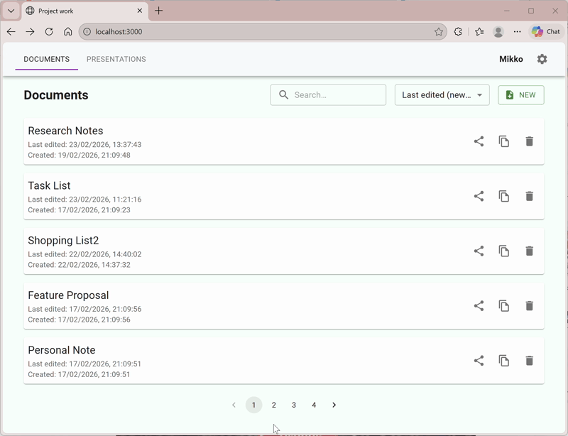

###  Locking Document

Document locking prevents two users from editing the same document at the same time.  
The lock is applied automatically when a user begins editing.

#### How Document Locking Works
1. When a user opens a document in **Edit** mode, the document becomes **locked**.
2. While locked, other users who have edit permissions cannot edit the document.
3. Users who try to edit a locked document will see that it is currently in use and unavailable for editing.
4. The lock remains active as long as the user stays in the editor.
#### Releasing the Lock
1. When the user leaves the editor (saving or canceling), the lock is automatically removed.
2. Once the lock is released, the document becomes available again.
3. The next user who opens the document in **Edit** mode becomes the new active editor.

This locking mechanism ensures that only one person edits a document at a time, preventing conflicts and accidental overwrites.

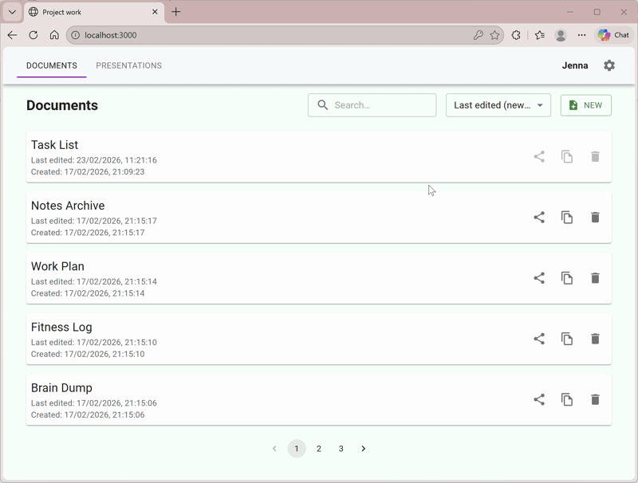

### Shorting Documents

You can sort your documents to quickly find what you need. The sorting options allow you to change the order of the list based on different criteria.

1. Open the **Documents** page.
2. Use the **Sort** control in the header of the document list.
3. Choose one of the available sorting methods:
   - **Name (A–Z)** – alphabetical order.
   - **Name (Z–A)** – reverse alphabetical order.
   - **Created (Newest)** – most recently created documents first.
   - **Created (Oldest)** – earliest created documents first.
   - **Last Edited (Newest)** – most recently updated documents first.
   - **Last Edited (Oldest)** – least recently updated documents first.

The document list updates immediately based on the selected sorting method.

### Search documents

The search feature helps you quickly find documents by name or content.

1. Open the **Documents** page.
2. Use the **Search** field at the top of the page.
3. Type a word or phrase you want to search for.
4. The list updates instantly and shows only the documents that match your search.
5. You can clear the search field at any time to return to the full list.

Search is especially useful when you have many documents and need to locate something specific quickly.

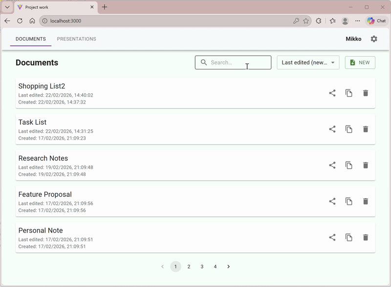

### Share document

You can share a document directly from the document list. Each document row includes its own Share button, allowing you to quickly choose who gets access.

1. Open the **Documents** page.
2. In the list, find the document you want to share.
3. Click the **Share** button next to the document title.
4. A dialog opens showing a list of all available users.
5. Select one or more users you want to share the document with.
6. Confirm the sharing action.

All selected users will immediately receive access to the document.  
Users with edit permissions can modify the document when it is not locked by another editor.

Sharing supports collaboration while document locking ensures that only one user edits at a time.

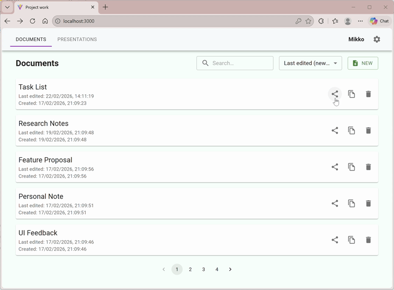

### Copy Document

You can create a duplicate of any document directly from the document list. Each document row includes a Copy button that makes it easy to create a new version based on an existing one.

1. Open the **Documents** page.
2. In the list, find the document you want to copy.
3. Click the **Copy** button next to the document title.
4. A new document is created immediately.
5. The copied document appears in the list with “(copy)” added to its title.  
   - Example: **Task List** → **Task List (copy)**

The copied document contains the same title, content, and images as the original.  
You can open and edit it just like any other document.

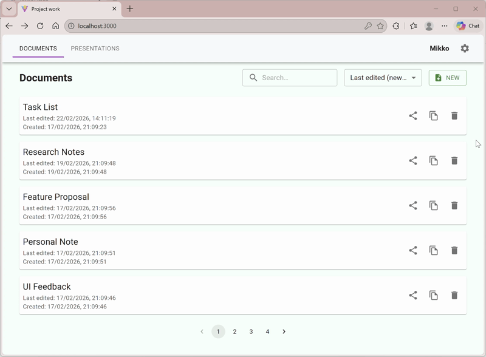

### Public Document

A document can be marked as public, making it accessible to anyone who has the public link. This is useful when you want to share information widely without selecting individual users.

1. Open the **Documents** page.
2. Select the document you want to make public.
3. On the document page, enable the **Public** toggle.
4. Once enabled, a **public link** is displayed.
5. Click the **Copy Link** button to copy the link and share it wherever needed (for example, by email or chat).

You can disable the public toggle at any time to make the document private again.

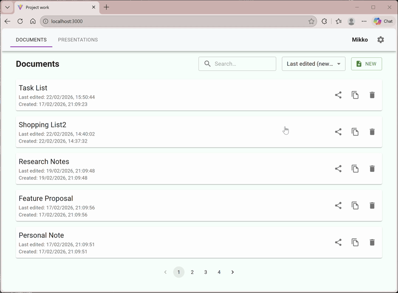

### Send Public Document by Email

When a document is marked as public, you can share its public link directly by email.

1. Open the **Documents** page.
2. Select the document you want to share.
3. Enable the **Public** toggle on the document page.
4. A **public link** becomes visible.
5. Next to the link, click the **Send** button.
6. A dialog opens where you can enter the recipient’s email address.
7. After entering a valid email click **Send** to deliver the public link by email.

This feature makes it easy to share public documents directly without copying the link manually.

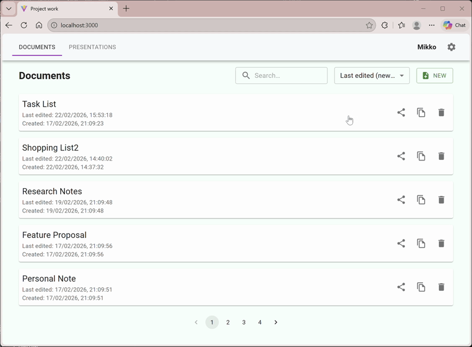

### Download document as pdf

You can download any document as a PDF file directly from the document page.

1. Open the **Documents** page.
2. Select the document you want to download.
3. On the document page, click the **Download as PDF** button.
4. The document is generated and downloaded as a PDF file.

The PDF includes the document’s title and text content.  
Images inside the document are not supported in the PDF export at the moment.

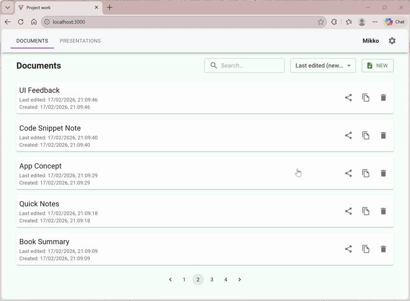

### Create Presentation

You can create a presentation in a similar way as creating a document. A presentation consists of a title and one or more slides.
#### Create a New Presentation
1. Open the **Presentations** page.
2. Click the **Create Presentation** button.
3. Enter the title of the presentation.
#### Add Slides
1. After creating the presentation, you can start adding slides.
2. For each slide, enter:
   - A **slide title**
   - A **bullet list** of points
1. Add as many slides as needed.
#### Finish the Presentation
1. When all slides have been added, click the **Create Presentation** button.
2. The presentation is created and added to the list of presentations.
3. The newly created presentation appears immediately in the list.

Presentations allow you to structure information into clear, slide‑based content.

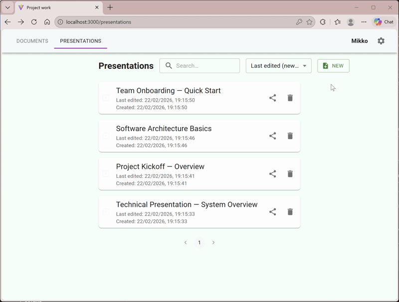

### Read Presentation

You can view any presentation that has been created. Reading a presentation shows one slide at a time with its title and bullet points.

#### Open a Presentation
1. Open the **Presentations** page.
2. In the list, select the presentation you want to read.
3. The presentation opens in read mode, showing the first slide.

#### Navigate Slides
You can move between slides using:
- **Swipe left or right** (on touch devices)
- The **Left** and **Right arrow buttons**

These controls allow you to move through the slides smoothly and at your own pace.

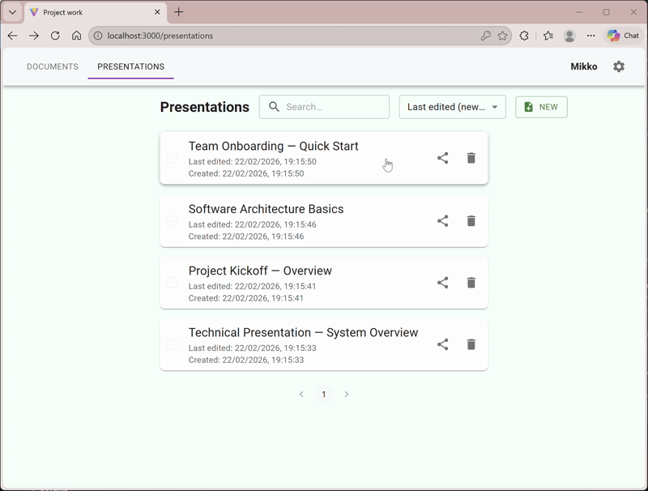

### Update Presentation

You can update an existing presentation in the same way as creating one. All current information is already filled in, allowing you to make changes easily.
#### Update an Existing Presentation
1. Open the **Presentations** page.
2. In the list, select the presentation you want to update.
3. The presentation opens with its existing title and slides already filled in.
#### Edit Slides
You can modify any part of the presentation:
- Change the **presentation title**
- Edit slide titles
- Update or reorder bullet points
- Add new slides
- Remove slides if needed
#### Save Changes
When you have finished updating the presentation, click the **Save Changes** button to save your changes.

The updated presentation is immediately available in the list of presentations.

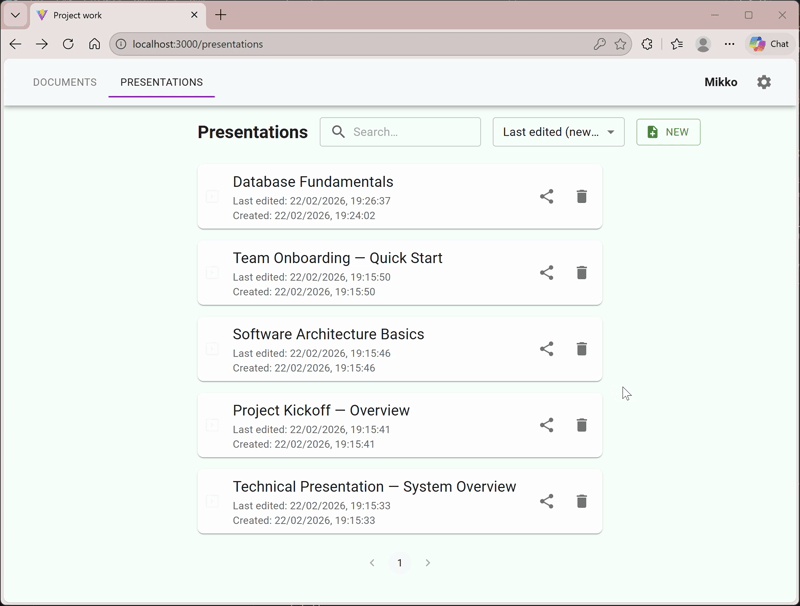

### Delete Presentation

You can permanently delete a presentation directly from the list of presentations.

1. Open the **Presentations** page.
2. In the list, find the presentation you want to remove.
3. Click the **Delete** button next to the presentation.
4. The presentation is deleted permanently and cannot be restored.
5. The list updates immediately and no longer shows the deleted item.

Note: Unlike documents, presentations cannot be recovered after deletion.

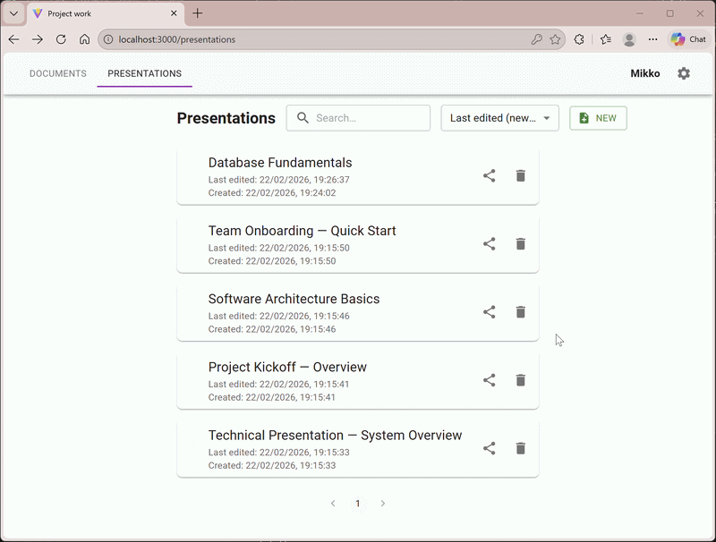

### Share Presentation

Presentations can be shared in the same way as documents. Each presentation in the list has its own Share button.

1. Open the **Presentations** page.
2. In the list, find the presentation you want to share.
3. Click the **Share** button next to the presentation title.
4. A dialog opens showing a list of all available users.
5. Select one or more users you want to share the presentation with.
6. Confirm the sharing action.

All selected users will immediately receive access to the presentation.

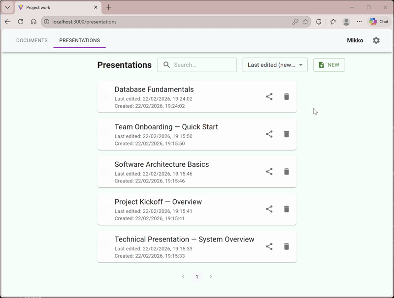

## Features

### Languages

You can switch the application language between English and Finnish. The language setting is available in the settings menu located on the right side of the header.
#### Change Language
1. Open the settings menu in the header.
2. Depending on the current language, select one of the following options:
   - **Switch to English**
   - **Vaihda suomeksi**
3. The application updates immediately to the selected language.

The menu option always shows the alternative language, making it easy to switch back and forth.

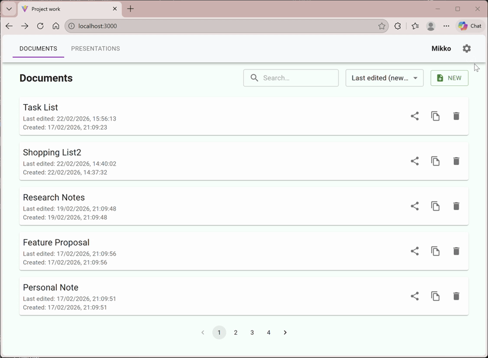

### User Profile Image

You can set a personal profile image that appears in your user account. The profile image can be uploaded from your local device.
#### Open Profile Page
1. Open the settings menu in the header.
2. Select **Profile** to open your user profile page.
#### Upload a Profile Image
1. On the profile page, choose an image from your local machine.
2. Upload the selected image.
3. The uploaded image is saved to your profile.
#### View Your Profile Image
When you return to the profile page later, the previously uploaded image is shown and remains stored until you replace it with a new one.

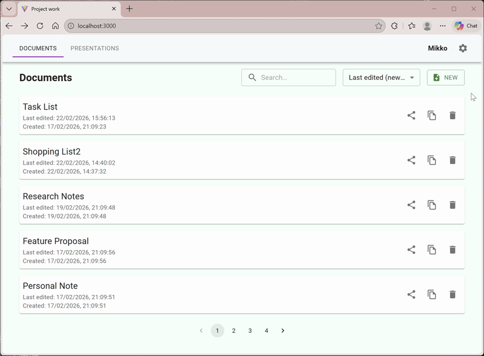

### Theme Light / Dark

You can switch the application appearance between light and dark themes. The theme setting is available in the settings menu on the right side of the header.
#### Change Theme
1. Open the settings menu in the header.
2. Select **Theme: Light** or **Theme: Dark**, depending on your current theme.
3. The application updates immediately to the selected theme.

The menu always shows the alternative theme, making it easy to switch whenever you prefer a different look.

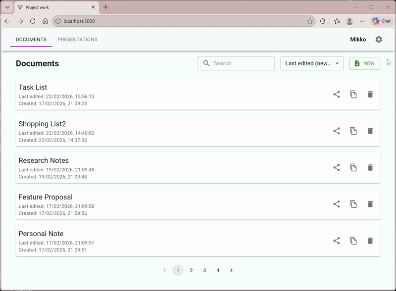

### About

The About page provides information about the application, including its purpose and main features. It can be accessed from the settings menu in the header.

The page gives users a clear overview of what the application is designed for and the key functionality it offers.

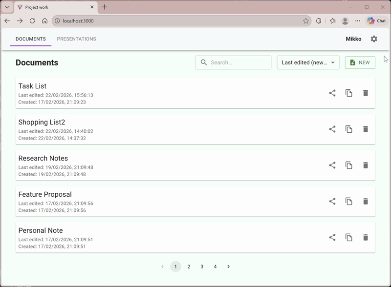

### Responsiveness

The application is fully responsive and adapts to different screen sizes. All pages and features work on desktop, tablet, and mobile devices.

On smaller screens, the navigation collapses into a **hamburger menu**, which provides access to documents, presentations. Touch interactions, such as swiping through presentation slides, are supported on mobile devices as well as touch‑screen devices.

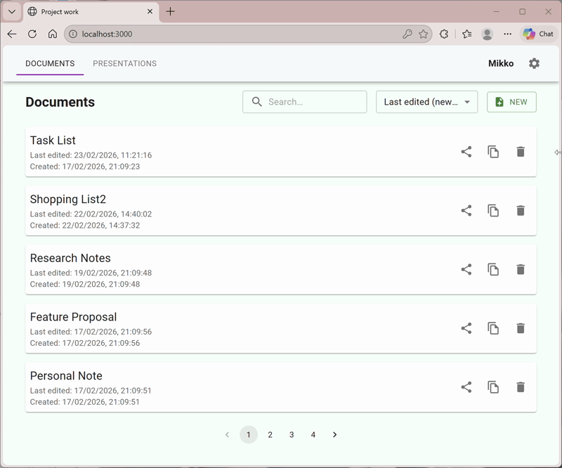

### Token Expiration

For security reasons, the user session token expires automatically after a period of inactivity. When the token has expired, the next action the user performs triggers a toast message:
**"Session expired. Please log in again."**

After the message is shown, the user must sign in again to continue using the application.

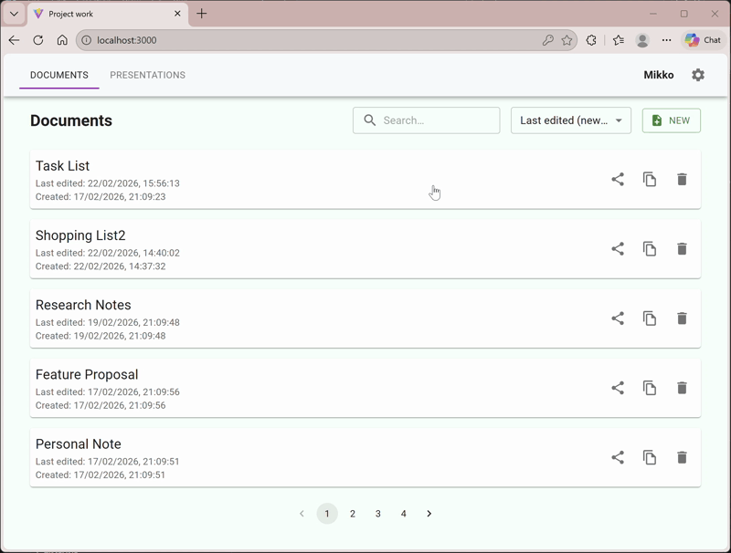

